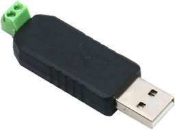

# Home Assistant integration for XY Screens projector screens and lifts

![Python][python-shield]
[![GitHub Release][releases-shield]][releases]
[![Licence][license-badge]][license]
[![Home Assistant][homeassistant-shield]][homeassistant]
[![HACS][hacs-shield]][hacs]\
[![Github Sponsors][github-shield]][github]
[![PayPal][paypal-shield]][paypal]
[![BuyMeCoffee][buymecoffee-shield]][buymecoffee]
[![Patreon][patreon-shield]][patreon]

# Introduction

Home Assistant integration to control XY Screens projector screens and lifts over the RS-485 interface.

XY Screens is an OEM manufacturer of projector screens and lifts, their devices are sold around the world under various brand names.

## Features

- Installation/Configuration through Config Flow UI
- Set the up and down time of your projector screen/lift
- Position the screen/lift on any position along the way
- Invert the default Cover Entity behaviour

## Hardware

I use a cheap USB RS-485 controller to talk to the projector screen where position 5 of the RJ25
connector is connected to D+ and position 6 to the D-.

See the documentation of your specific device on how to wire yours correctly.

## Supported protocol

If your devices follows the following protocol it's supported by this Home Assistant integration:

2400 baud 8N1\
Up command  : 0xFFAAEEEEDD\
Down command: 0xFFAAEEEEEE\
Stop command: 0xFFAAEEEECC

## Known to work

The following device is known to work:

* iVisions Electro M Series

The following device are not tested but use the same protocol according to the documentation:

* iVisions Electro L/XL/Pro/HD Series
* iVisions PL Series projector lift
* Elite Screens
* KIMEX
* DELUXX

Please let me know if your projector screen or lift works with this Home Assistant integration so I can improve the overview of supported devices.

## Caution

This integration follows the Cover Entity where open means retracting the screen and close opens
the screen, like how rolling blinds, garage doors and curtains work. For a projector screen this is
counter intuitive. You can chose to invert this behaviour when adding your device. If you use voice commands this is recommended.

## Installation

### HACS

The recomended way to install this Home Assistant integration is using by [HACS][hacs].
Click the following button to open the integration directly on the HACS integration page.

Or follow these instructions:

- Go to your **HACS** view in Home Assistant and then to **Integrations**
- Select **+ Explore & download repositories** and search for *XY Screens projector screens and projector lifts*
- Select **Download**
- Restart Home Assistant

### Manually

- Copy the `custom_components/xyscreens` directory of this repository into the
`config/custom_components/` directory of your Home Assistant installation
- Restart Home Assistant

##  Adding a new XY Screens projector screen or projector lift

- After restarting go to **Settings** then **Devices & Services**
- Select **+ Add integration** and type in **XY Screens**
- Select the serial port or enter the path manually
- Select the type of device, projector screen or projector lift
- Set the up and down times of your device.
- Select **Submit**

A new XY Screens integration and device will now be added to your Integrations
view.

## Contributing

If you would like to use this Home Assistant integration in youw own language you can provide me with a translation file as found in the `custom_components/xyscreens/translations` directory. Create a pull request (preferred) or issue with the file attached.

More on translating custom integrations can be found [here](https://developers.home-assistant.io/docs/internationalization/custom_integration/).

## Support
Do you enjoy using this Home Assistant integration? Then consider supporting my work using one of the following platforms:

[![Github Sponsors][github-shield]][github]
[![PayPal][paypal-shield]][paypal]
[![BuyMeCoffee][buymecoffee-shield]][buymecoffee]
[![Patreon][patreon-shield]][patreon]

---

[python-shield]: https://img.shields.io/badge/python-3670A0?style=for-the-badge&logo=python&logoColor=ffdd54
[releases]: https://github.com/rrooggiieerr/homeassistant-xyscreens/releases
[releases-shield]: https://img.shields.io/github/v/release/rrooggiieerr/homeassistant-xyscreens?style=for-the-badge
[license]: ./LICENSE
[license-badge]: https://img.shields.io/github/license/rrooggiieerr/homeassistant-xyscreens?style=for-the-badge
[homeassistant]: https://www.home-assistant.io/
[homeassistant-shield]: https://img.shields.io/badge/home%20assistant-%2341BDF5.svg?style=for-the-badge&logo=home-assistant&logoColor=white
[hacs]: https://hacs.xyz/
[hacs-shield]: https://img.shields.io/badge/HACS-Default-41BDF5.svg?style=for-the-badge
[paypal]: https://paypal.me/seekingtheedge
[paypal-shield]: https://img.shields.io/badge/PayPal-00457C?style=for-the-badge&logo=paypal&logoColor=white
[buymecoffee]: https://www.buymeacoffee.com/rrooggiieerr
[buymecoffee-shield]: https://img.shields.io/badge/Buy%20Me%20a%20Coffee-ffdd00?style=for-the-badge&logo=buy-me-a-coffee&logoColor=black
[github]: https://github.com/sponsors/rrooggiieerr
[github-shield]: https://img.shields.io/badge/sponsor-30363D?style=for-the-badge&logo=GitHub-Sponsors&logoColor=#EA4AAA
[patreon]: https://www.patreon.com/seekingtheedge/creators
[patreon-shield]: https://img.shields.io/badge/Patreon-F96854?style=for-the-badge&logo=patreon&logoColor=white
